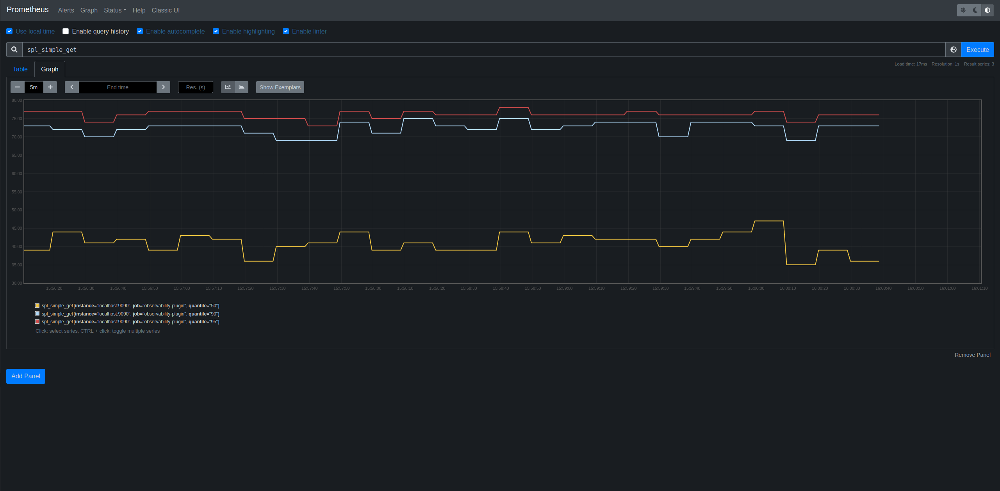

# ULP OBSERVABILITY PLUGIN

[UbikLoadPack](https://UbikLoadPack.com) observability plugin is an extension for Apache JMeter which allows you to monitor a performance test (Standalone or distributed) from your browser.

It also exposes an Open Metrics endpoint so that Promtheus or similar tools can scrape it and make metrics of your performance test available
in it.

It is easily installable through [JMeter-Plugins manager](<https://jmeter-plugins.org/?search=observability>)

## Connect the plugin to Prometheus


### Install Prometheus
If you haven't installed prometheus on your device yet, 
[Download the latest release of Prometheus](https://prometheus.io/download/) for your platform, then extract it.
If you use Windows, add the extracted directory to the PATH env variable.
For Linux users, add it to the $PATH variable. Add it to the .bashrc file to make it permanent.

### Prometheus configuration
Inside the directory of your JMeter test plan, add the following prometheus.yml file :
```yml
global:
  scrape_interval:     15s # By default, scrape targets every 15 seconds.

  # Attach these labels to any time series or alerts when communicating with
  # external systems (federation, remote storage, Alertmanager).
  external_labels:
    monitor: 'codelab-monitor'

# A scrape configuration containing Observability plugin endpoint to scrape:
scrape_configs:
  - job_name: 'observability-plugin'
    scrape_interval: 5s
    metrics_path: /ulp-o-metrics

    static_configs:
      - targets: ['localhost:9090']
```
Change 'localhost:9090' to match the port you are using to host the plugin.

### Prometheus launch
Cd to the test plan directory, then enter this command to start using prometheus (on port 9095, change it with the one you prefer) :
```bash
prometheus  --web.enable-admin-api   --web.listen-address=:9095 --config.file=prometheus.yml
```

You can then access Prometheus from this url :
http://localhost:9095/graph

## Metrics to display:

- Name of the Sampler used for the load test
- Number of requests
- % Error
- Average time
- Percentiles 1 (aggregate_rpt_pct1 property)
- Percentiles 2 (aggregate_rpt_pct2 property)
- Percentiles 3 (aggregate_rpt_pct3 property)
- Max time
- Throughput in req/s

## Constraints:

- Have the lightest possible memory / CPU footprint on JMeter performances
- Ability to handle up to 1 million requests per minute
- Select a Javascript graphing library that is free and Open Source compatible or paid but in One Shot only
- Develop the solution in Plugin
- Must not block the caller
- Use a light server in terms of memory / CPU consumption (Embedded Jetty)
- Java 11 compatible code

## Technologies and dependencies:

### Back

#### Completed tasks

- Multithreaded sample processing
- Distributed testing support
- Custom sampler configuration
- Metrics logging
- Metrics available in OpenMetrics format through the Jetty server
- HTML page with metric charts
- Javadoc

#### Screenshots

<p align="center">
<br/>
<em>Observability Listener JMeter Control Panel</em> 
<br/>
<br/>
<br/>
<em>Example of metrics summary in non-graphical mode</em>
<br/>
<br/>
<br/>
<em>Sample response from Jetty server for sample metrics in OpenMetrics format</em>
</p>


### Front

#### Completed tasks

- Synchronization with plugin configuration
- HTML page with metrics correctly displays multi-axis charts for each type of metric
- Summary of total metrics at the bottom of the page

#### Screenshots

<p align="center">
<br/>
<em>Example of a metric chart</em> <br />
</p>

- Left y-axis: metric of each group of samples
- Right y-axis: cumulative number of threads in each group of samples
- Graphs currently implemented for: average response, maximum response, percentiles, error percentage and throughput

<br />
<p align="center">
<br/>
<em>Example summary of total metrics</em> <br />
</p>


### Roadmap

See [our repository issues](https://github.com/ubikingenierie/ulp-observability-plugin/issues?q=is%3Aopen+is%3Aissue+milestone%3A1.0.0)


### Want to contribute

Read our [Contributor documentation](contributor-jumpstart.md)