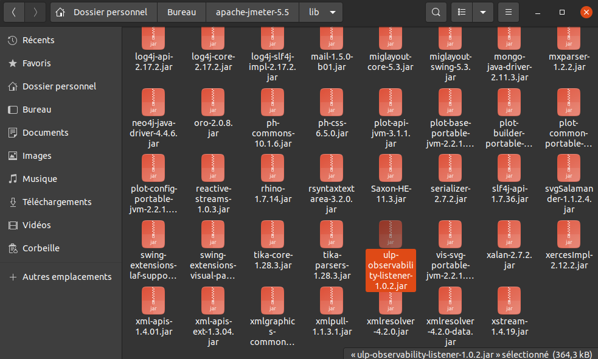
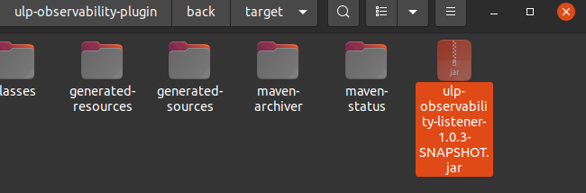
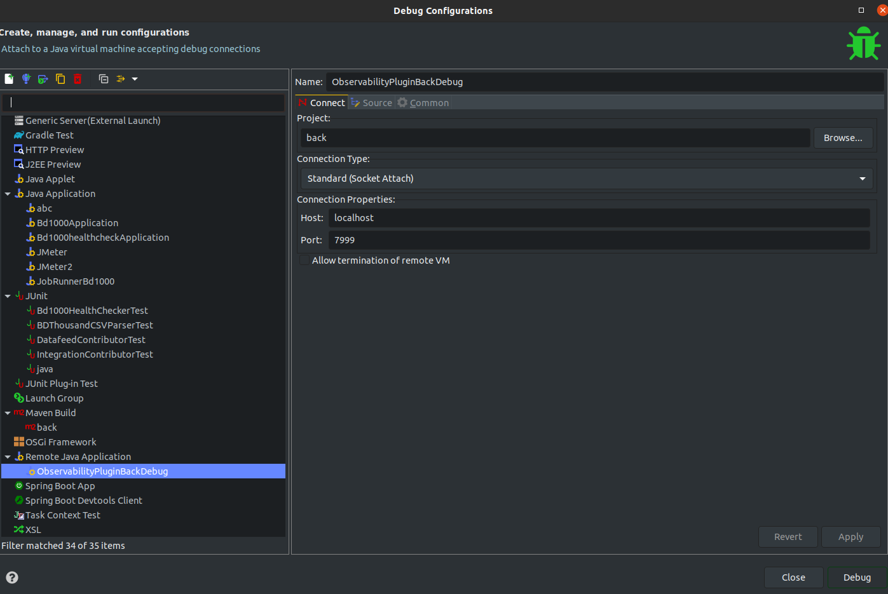

# Backend

## Constraints:

- Have the lightest possible memory / CPU footprint on JMeter performances
- Ability to handle up to 1 million requests per minute
- Rely on Javascript graphing library that is free and Open Source compatible
- Develop the solution as a JMeter Plugin
- Listener must not block the caller
- Use a light server in terms of memory / CPU consumption (Embedded Jetty)
- Java 11 compatible code

## Technologies

- [Java](https://www.java.com/) : Language used by JMeter
- [Embedded Jetty](https://www.baeldung.com/jetty-embedded) : to expose the metrics collected by SamplerListener (specific to JMeter) and calculated by HDRHistogram offers a very light server implementation
- [Micrometer](https://micrometer.io/) : to save samples and calculate more metrics
- [CronScheduler](https://github.com/TimeAndSpaceIO/CronScheduler/) : for a clock drift insensitive task scheduler
- [openapi-generator-maven-plugin](https://github.com/OpenAPITools/openapi-generator/tree/master/modules/openapi-generator-maven-plugin) : to generate APIs and models
- [Jackson](https://github.com/FasterXML/jackson) : for API response serialization
- [Junit](https://www.jmdoudoux.fr/java/dej/chap-junit.htm) : Unit tests

## Default configuration

The default properties we get when we create an ULP observability sampler are in the file ULPODefaultConfig.java.
This class provides the defaults, and specify the keys to use if we want to override them in a JMeter property file.

## How it works

- When a test is started, the method 'testStarted(String host)' from the ULPObservabilityListener class is triggered.
- This method starts a jetty server using the configuration metioned earlier. This server exposes through 2 Servlets (ULPObservabilityConfigServlet, ULPObservabilityMetricsServlet) which are called by the frontend in order to get the data to render.
- Then it creates X threads (X being equal to the Number of Processing Threads in the sampler GUI). These threads are instances of the class MicrometerTask.java.
As long as the test plan is running, the threads are retrieving the samples results from a queue, and add them to a MicrometerRegistry instance.
- Micrometer is a library used to calculate metrics averages based on metrics it receives upon time. The MicrometerRegistry class is a wrapper that contains 2 instances of this library.
    - The first calculate averages for the current time interval, for each samplers + their respective thread group independantly. We will call the current time interval Y for later use in this document (Y being the time interval defined by the 'Log Frequency in seconds').
    - The second add each new interval metrics to the previous one, to calculate total values.
 in order to process sampler results as long as they are called. These instances are fed with the samplers data from the current time interval defined by Y seconds.
Each Y seconds a cron job (LogTask.java) will reset the data which were used to calculates the metrics for the current interval. It keeps the interval metrics results in a logger, but cleans everything else. 
- The logger (SampleLogger) is used to store every results obtained through the Micrometer instances. It exposes its datas with a format that Prometheus and the frontend can read.
- The queue on which the threads are retrieving datas is fed by JMeter each time a sampler complete its requests, thanks to the sampleOccurred(SampleEvent e) method overridden in ULPObservabilityListener.
- The first servlet, ULPObservabilityConfigServlet, is used to tell the frontend on which url it can get the intervals datas it needs to render + Y value. Y is used by the frontend as the refresh timer. Each Y seconds, it will ask the back for new datas.
- The second servlet, ULPObservabilityMetricsServlet, provides 2 informations :
    - The last interval metrics which has to be dynamically added to the already displayed graphs with Angular.
    - Every intervals metrics since the start of the test. It is used one time when the front calls for the first time the backend in order to get everything it needs to display. After that, the front only asks for the last interval datas.
    -  As mentionned earlier, these metrics come from the Logger contained in the MicrometerRegistry.

# Frontend

## Technologies

- [TypeScript](https://www.typescriptlang.org/) : to take advantage of a strongly typed language for more rigor and data consistency 
- [Angular](https://angular.io/): for the front and graphing part :
         - States and hooks to facilitate data manipulation (Metrics)
         - npm repo for various dependencies
         - ChartJs available
         - Material UI for elegant rendering
- [ChartJs](https://www.npmjs.com/package/chart.js?activeTab=readme) : Popular Library, maintained and free

## How it works

The Angular application starts by asking the backend informations about the refresh rate of the graphs and the url to retrieve graphs datas on the first servlet.
After that, it asks the backend everything it needs to display on the graphs. Then, every Y seconds (see backend section), it asks the backend the newest interval datas and update its graphs with it.

# Start developing

## Prior setup

- First of all, you must install JMeter. We will need to have access to its /lib folder, where the jar of the plugins are installed.
- Install the production plugin by following the instruction at https://www.ubik-ingenierie.com/blog/ubik-load-pack-observability-plugin/ in the Installation section.
- Once you installed it the normal way, check its name inside the lib folder :

We can see here that the full name of the jar at the time this doc is written is 'ulp-observability-listener-1.0.2.jar'. We will need this name later.

## Front
```bash
cd yourPluginPath/ulp-observability-front/src/main/front
```
If it is the first time you execute the front :
```bash
npm install
```
Start the front :
```bash
npm start
```
At this point you can debug your frontent at localhost:4200.
You can also see the front at localhost:9090/yourUlpListenerRoute, but you won't have the sources files exposed in the browser, and you would need to re-build the jar everytime as discussed below in the back section.


If you need to change the port on which the backend exposes the data, you must change the port in proxy.conf.json.

## Back

### Make JMeter use your current version of the plugin

The backend is a little bit trickier to setup than the frontend. Each time you do a modification to the backend code, you must run the following command to re-build the jar.
```bash
mvn clean install
```
Once it is done, the jar of the under developpement observability plugin will be located in /back/target :

The next step is to replace the jar inside the jmeter libs with this new one. You also need to rename it to match the previous jar name. You can do it either manually or using this command, replacing the args with your own paths and jar names :
```bash
mv PLUGIN_HOME/back/target/ulp-observability-listener-1.0.3-SNAPSHOT.jar JMETER_HOME/lib/ulp-observability-listener-1.0.2.jar
```

After that, your backend change is used by JMeter.

### Bash script 

 We will see now a way to make it faster + how to plug the eclipse debugger to your JMeter plugin code :
- Add your jmeter/bin folder to your bashrc file so you can access the scripts inside it every time you open a command prompt.
- In the bin folder of jmeter, duplicate the 'jmeter' file, and rename the copy 'jmeterDebug'
- Inside jmeterDebug, add the following line right after '#! /bin/sh', as line 2 :
```bash
JVM_ARGS="-agentlib:jdwp=transport=dt_socket,server=y,suspend=n,address=127.0.0.1:7999"
```
The 'address=127.0.0.1:7999' part is here to give a port on which we can listen to debug JMeter. You can change the port freely to what you prefer.
- In the same bin folder, create a second file named 'observabilityPluginSetup'. Fill it with :
```bash
#! /bin/sh

# Make the clean install from the plugin project root folder

cd /PLUGIN_HOME
mvn clean install

# Move the generated jar in the JMeter libs, with the name of the previous jar

mv /PLUGIN_HOME/back/target/ulp-observability-listener-1.0.3-SNAPSHOT.jar /JMETER_HOME/lib/ulp-observability-listener-1.0.2.jar

# Start JMeter in debug mode

# jmeterDebug
```
You must change the paths to yours. You can uncomment the last line if you also want to start JMeter in GUI mode each time you make a change.

Once you have done all of this, you can simply open a command prompt, and type 
```bash
observabilityPluginSetup
```
This way it will make the clean install, and move your jar to the correct location with the right name.

### Eclipse debug

If you start JMeter with the above defined scripts (uncomment the last line of observabilityPluginSetup), then you can connect the eclipse debuguer to the running JMeter :
Go to 'debug configurations', then create a new Remote Java Application like this. 'back' is the back folder inside the project.
.
Once it is done, start JMeter with one of the 3 following way :
- By generating the jar with your back with the above command (with the last line not being a comment) : 
```bash
observabilityPluginSetup
```
- If you haven't changed anything in the back, you can simply do this to start JMeter in debug, assuming you created the jmeterDebug file :
```bash
jmeterDebug
```
- You can start a test plan in command line without the GUI like this, be careful to the location where you use this command because it also generate a test report in the folder when the test finish :
```bash
jmeterDebug -n -t /path/to/some/plans/myTestPlan.jmx -l TestPlan.csv -j jmeter.log -e -o report-test-plan
```

When JMeter starts either in GUI or non GUI mode, you can launch your debug configuration in eclipse. If you don't have any error message when you do it, it means the connection was a success. You can then put breakpoints in your backend and start debuging.

