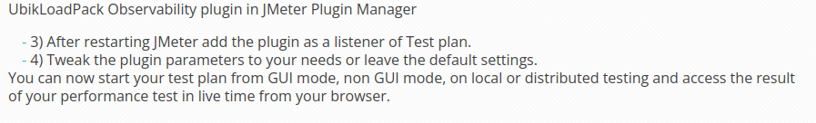
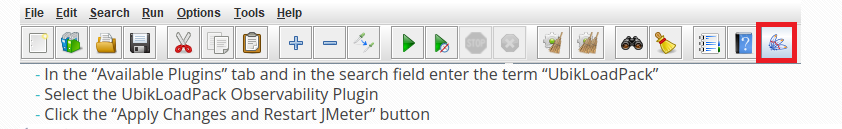
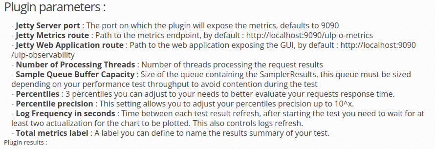
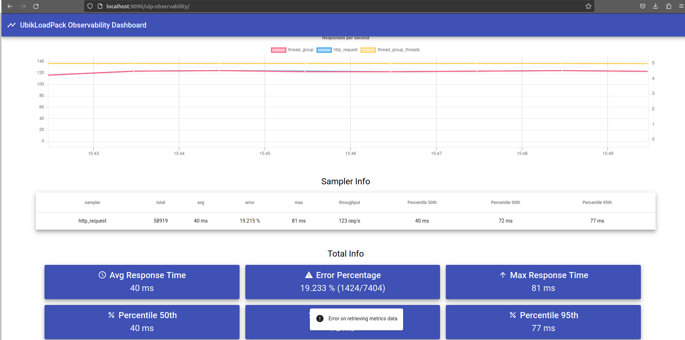

# Page de doc 1 -> https://www.ubik-ingenierie.com/blog/monitor-jmeter-test-from-browser/

La remarque 3 n'est pas bien illustrée.
Il faudrait une image ou du texte pour dire que ça vient de add -> listener -> ULP observability

# Page de doc 2 -> https://www.ubik-ingenierie.com/blog/ubik-load-pack-observability-plugin/

je n'ai pas l'icone qui est entouré, j'ai du la trouver dans Options -> plugins managers. ça peut être bien de le mentionner si les gens n'ont pas non plus l'icone.

Jetty Metrics route -> je comprend pas bien ce qui est affiché sur cette route et à quoi elle sert.
Je suppose que c'est un truc utile pour le dev du plugin ?

Number of Processing Threads -> En quoi est-ce que c'est utile de faire varier le nombre de threads qui lisent les réponses aux requêtes ? Je suppose que àa optimise les calculs sur les réponses mais c'est pas explicite vu qu'on peut aussi augmenter le nombre de threads ailleurs dans Jmeter et que ça sert à simuler plus de traffique, ce qui n'est pas la même chose.

Log Frequency in seconds -> Il faut expliquer plus en détail certaines choses la dessus. J'ai vu qu'en mettant 60 (la valeur par défaut) dessus, si mon test dure 100 secondes, je n'ai aucun résultats qui s'affiche dans les graphs. Si je passe la durée du test à 500 secondes, j'ai des infos dans les graphiques. En lisant la doc on le finit par le comprendre, mais ce serait peut être plus clair en disant quelque chose du style "Si par exemple votre test dure + de 120 secondes, vous pouvez utiliser un 'Log Frequency in seconds' de 60 maximums, sans quoi vous n'aurez pas d'affichage dans les graphiques". Mettre le chiffre par défaut de 60 secondes à 10 secondes. L'utilisateur verra plus vite ses résultats lors de la création et du lancement du test, quitte à ce qu'il doive le rmeonter plus tard à cause des performances.

Sample Queue Buffer Capacity  -> Je vois pas bien ce que c'est. Mais la c'est peut être parceque j'ai pas fait de Jmeter depuis un moment ? En tout cas la valeur par défaut c'est 5000, mais c'est 5000 quoi ? La doc dit que ça contient des SamplerResults, mais je me représente mal ce que c'est ici. Pour moi un Sampler result je dirais que c'est ce qu'on peut voir dans un View Result Tree en mode GUI par exemple, sinon je vois pas trop. Du coup question -> est-ce que la doc doit être utilisable par un débutant en JMeter ou alors on suppose qu'ils ont forcément déjà des bonnes connaissances sur l'outil ?

# Des erreurs
J'ai essayé de le faire tourner en mode GUI pour commencer et voir ce que ça donne. J'ai rapidement fait un test plan très simple ou je le fais tourner 500 secondes, 5 threads. A chaque tour les threads faisaient un unique appel GET sur un localhost:3000 très basique quej 'ai fait rapidement. Ce endpoint renvoie une erreur 400 20% du temps, et met en moyenne 40 ms à répondre.

Je suppose que ce que j'ai fait ressemble au cas le plus basique possible, mais j'ai quand même des alertes d'erreurs sur la page avec les graphiques. En bas de l'image on peut voir le messagge d'erreur.

J'ai l'impression que l'erreur vient lorsque le test a finit de tourner. Le browser ne peux plus récupérer d'infos et affiche donc une erreur.

# Interface browser
- Le nombre de threads à droite des courbes n'est pas clair. Si il s'agit simplement d'un seul nombre qui varie au cours du temps, c'est mieux de l'avoir tout seul dans un graph dédié plutot que sur tous les graphs.
- Renommer "thread_group" dans tous les graphs par "average response time (ms)", "average error %", "max response in ms", pour les percentiles -> "average response time (ms)"
- Dans la barre de recherche, mettre un petit texte par défaut du style "Filters. Type the name of an HTTP request to only see this one on graphs". Dans cette barre, le nom correspondant aux barres de l'anciennement "thread_group" serait "averages".
- Ajouter une croix sur le message d'erreur. Il cache des informations en bas de page et ne peux pas être supprimé.

# Usage
Est-ce que les gens ne l'utilisent pas simplement car ils n'ont pas le besoin d'avoir les informations du test en direct ?
J'ai jamais fait de test JMeter sérieux donc je sais plus comment on fait pour avoir les résultats d'un gros test, mais est-ce que les gens ne se sont pas simplement habitués à lire ces résultats la et n'ont donc pas spécialement besoin d'utiliser ce plugin ?
De mémoire les résultats qu'ont obitent avec des tests JMeter c'est aussi des graphs sur de l'html/css si je dis pas de bêtises -> c'est assez similaire à ce plugin non ?

# Installation
Je n'ai eu aucun problème pour l'installation, tout a marché du premier coup. On peut mentionner le fait qu'il faut pas mal scroller pour trouver le plugin dans la liste des plugin une fois qu'on a ajouté le jar. J'en avais un bon paquet contrairement à l'image sur la doc ou en voit que 4.

# Améliorations possbiles
- Est-il possible dans un test JMeter de faire varier fortement le nombre de requêtes executés par secondes ? Par exemple, les 30 premières secondes d'un test, on aurait 40 requêtes/s, et les 30 suivantes on aurait 20 requêtes/s. Avec les graphs qu'on a, je ne crois pas qu'ont soit en capacité de voir facilement ces changements la. On pourrait les "deviner" si les temps de réponses changer à cause de la charge, mais ce n'est pas affiché directement. Est-ce que ce serait une bonne idée d'ajouter une courbe qui afficherait le nombre de requêtes executés sur chaque portion de logs ? Comme ça on pourrait voir tout de suite ce type de variations.

- Dans le rendu html de JMeter, on a des graphs qui ont un refresh de données toutes les 60 secondes, alors qu'en mettant 10 secondes dans les paramètres du plugin, les graphs du plugins ont un refresh de données toutes les 10 secondes. Je suppose que c'est une histoire de fichier .properties. Peut être qu'il faudrait indiquer aux utilisateurs qu'il faut éventuellement modifier cette propriété dans un fichier de propriété JMeter afin d'avoir le même refresh time sur les 2.

- Est-ce que c'est possible de sauvegarder l'html montré ? Si c'est le cas je n'ai pas trouvé comment faire. Je trouve que les graphs du plugins sont assez pratiques à regarder, peut être que l'utilisateur veut pouvoir les sauvegarder aussi. On pourrai le mettre dans le report-test-plan généré en ligne de commande ?

