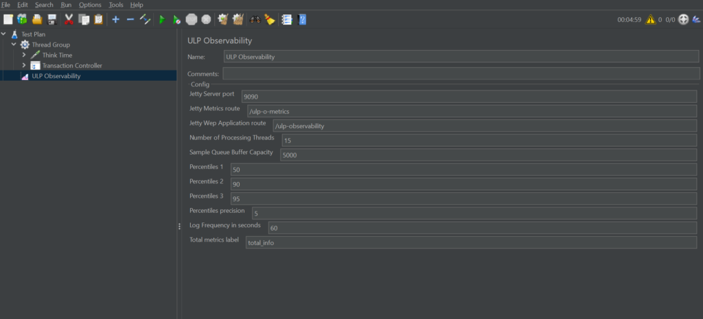
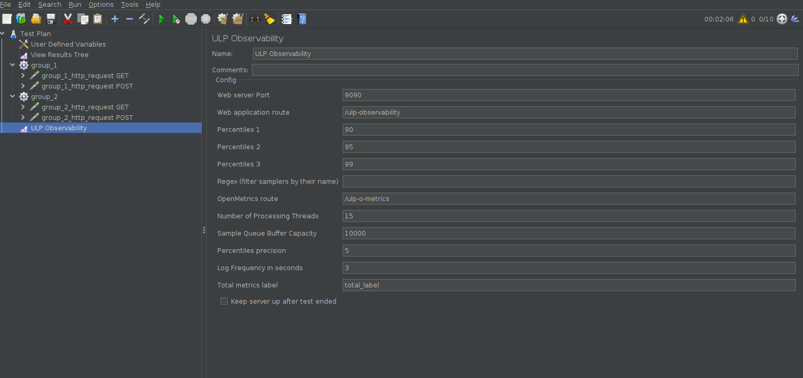
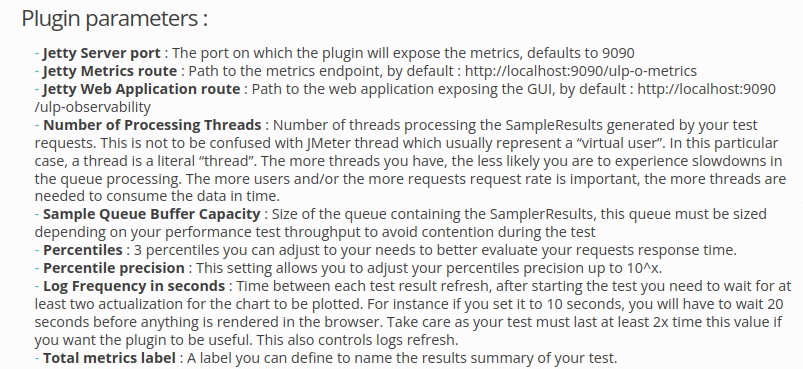
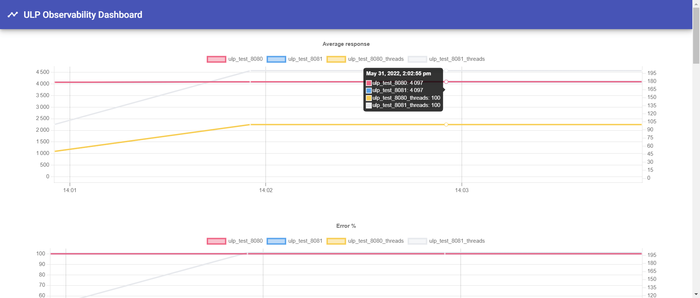
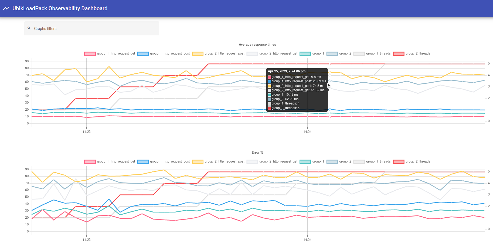
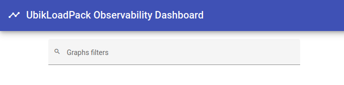
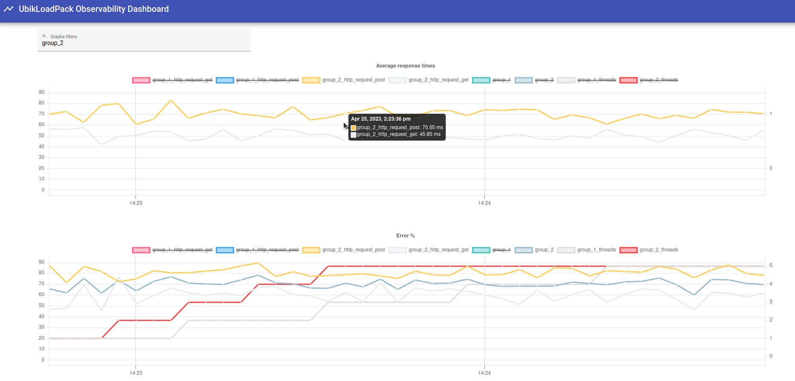
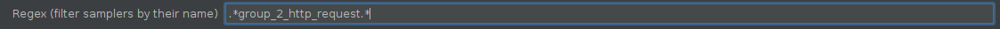
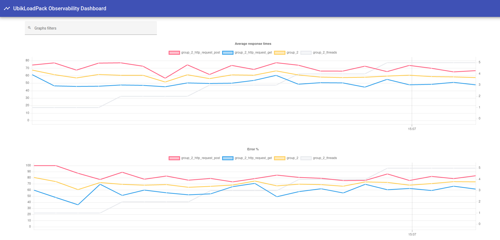

# https://www.ubik-ingenierie.com/blog/ubik-load-pack-observability-plugin/
Replace this image :

By this one :

In the following parameters part :

- Change the parameters order in doc to match the new UI
- Change '<strong>Jetty Server port</strong>' to '<strong>Web Server port</strong>'
- Change '<strong>Jetty Metrics route</strong>' to '<strong>OpenMetrics route</strong>'
- Change '<strong>Jetty Web Application route</strong>' to '<strong>Web Application route</strong>'
- Change the '<strong>Sample Queue Buffer Capacity</strong>'  text to :
Size of the queue containing the SamplerResults, this queue must be sized depending on your performance test throughput to avoid contention during the test. If you get array overflow errors, you should either increase this value, or increase the number of processing threads, or both.
- Change '<strong>Percentile precision</strong>' -> the text is unclear. The real meaning of this parameter is to tell how much digits we want to have on our percentiles. The more digits we have, the hardest it is to compute the values. This parameter only accept a value between 1 and 5 included.
- Add '<strong>Regex</strong>' :
Empty by default, which means every samplers are rendered by the plugin. You can put a regex that try to match a sampler name. If it does, the sampler is rendered. For instance, if in the above test we only want to display the group 2 samplers, we could put a regex which accept every name containing 'group_2' like this one : '.\*group_2_http_request.\*'

Replace this image :

By this one :

Then, add the following chapter :

If you feel like your graphs have too many lines, you can use the navbar at the top of the interface :

In the below exemple, we filtered the displayed lines thanks to the navbar and by clicking on some names at the top which enable/disable them.

Alternatively, you can use the regex parmeter presented earlier like this, and directly have the samplers you are interested in.
This filtering is done on the server side and would also reduce resources used by JMeter.

A good practice concerning the name of the samplers is to prefix their name with the group name. As such, if your group name is 'group_2', your samplers name should start with 'group_2'. This way you can very easily filter them with the thread group name.

# https://www.ubik-ingenierie.com/blog/monitor-jmeter-test-from-browser/
Replace this image :

By this one :

